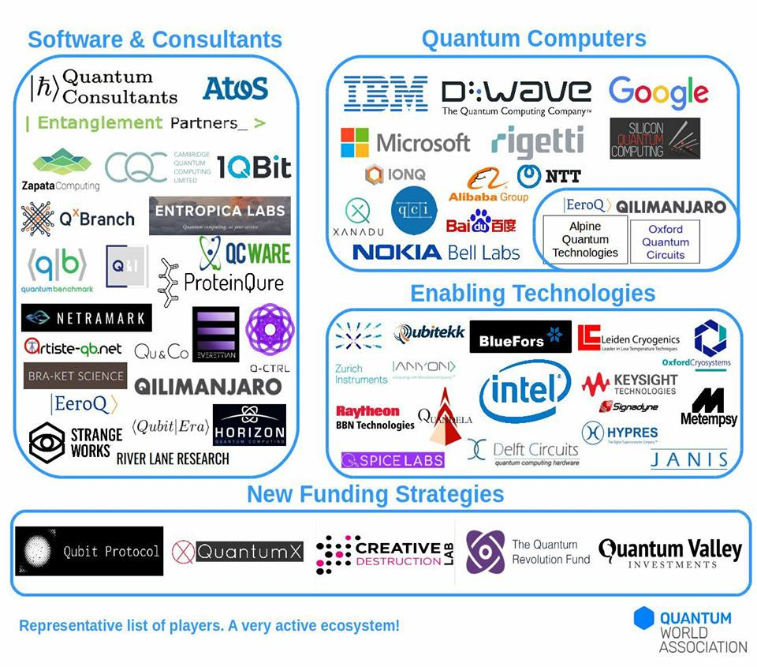

# A GUIDE TO QC AND QI

> _“… the laws of physics present no barrier to reducing the size of computers until bits are the size of atoms, and quantum behavior holds sway.”_ Richard P. Feynman (1985)

This guide is intended for researchers entering the area of Quantum Computation and Quantum Information Science.

### OVERVIEW & PURPOSE
Quantum computing is a multidisciplinary field of research including quantum physics, computer science and linear algebra. The goal of quantum computing is to compute tasks more quickly, by using the laws of quantum physics, which classical computers either do slowly or cannot solve in polynomial time. Of course, classical computers will always stay with the mankind to assist quantum computers at least with error correction and control flow.   
The two main resources of the speedup are the so called superposition and entanglement: a quantum system can be in superposition of two (or more) states, also, be entangled with another system. Entanglement is a type of correlation that is stronger than any classical correlation. When there is entanglement involved, one rather think of many-partite system as one (possibly nonlocal) object than a system of correlated objects.  
The guide assumes some knowledge of linear algebra and some programming language in order to go deeper into quantum computing research.

### Contents
- [PREREQUISITES](#prerequisites)
- [ONLINE COURSES](#ONLINE-COURSES)
- [MANUALS](#MANUALS)
- [LECTURE NOTES](#LECTURE-NOTES)
- [QUANTUM MECHANICS](#QUANTUM-MECHANICS)
- [VIDEO LECTURES FROM INTERNATIONAL SUMMER SCHOOLS AND CONFERENCES](#VIDEO-LECTURES-FROM-INTERNATIONAL-SUMMER-SCHOOLS-AND-CONFERENCES)
- [QUANTUM PROGRAMMING FRAMEWORKS](#QUANTUM-PROGRAMMING-FRAMEWORKS)
- [STAY UP-TO-DATE](#STAY-UP-TO-DATE)
- [ROADMAPS and REPORTS](#roadmaps)
- [POPULAR PRESS](#press)
- [REPRESENTATIVE PLAYERS IN THE FIELD](#representatives)
- [RESEARCH TOPICS WITH REFERENCES](#RESEARCH-TOPICS-WITH-REFERENCES)
	1. [Quantum Computation](#Quantum-Computation) 
	2. [Quantum Information](#Quantum-Information)
	3. [Quantum Algorithms](#Quantum-Algorithms)
	4. [Quantum Complexity](#Quantum-Complexity)
	5. [Quantum Simulation](#Quantum-Simulation)
	6. [Quantum Hardware: Physical Realizations](#Quantum-Hardware)
		1. [General review](#General-review)
		2. [Spin](#Spin)
		3. [Ion traps](#Ion-traps)
		4. [NV-centers](#NV-centers)
		5. [Photonic](#Photonic)
		6. [Superconducting](#Superconducting)
		7. [Topological](#Topological)
	7. [Quantum Cryptography](#Quantum-Cryptography)
	8. [Quantum Error Correction](#Quantum-Error-Correction)
	9. [Quantum Machine Learning](#Quantum-Machine-Learning)
	10. [More topics (Mainly Open Areas of Research)](#More-topics)
### PREREQUISITES

* LINEAR ALGEBRA  
[This MIT course](https://ocw.mit.edu/courses/mathematics/18-06sc-linear-algebra-fall-2011/syllabus/) covers matrix theory and linear algebra, emphasizing topics useful in disciplines such as physics, economics and social sciences, natural sciences, and engineering.  

* PROBABILITY THEORY  
**G. R. Grimmett and D. R. Stirzaker. _Probability and Random Processes_. Clarendon Press, Oxford, 1992.**  
**D. Williams. _Probability with Martingales_. Cambridge University Press, Cambridge, 1991.**  

* NUMBER THEORY  
**N. Koblitz. A Course in Number Theory and Cryptography. Springer-Verlag, New York, 1994.**  
Chapter 33 of **T. H. Cormen, C. E. Leiserson, and R. L. Rivest. _Introduction to Algorithms_. MIT Press, Cambridge, Mass., 1990**  
Chapter 10 of **G. H. Hardy and E. M. Wright. _An Introduction to the Theory of Numbers_, Fourth Edition. Oxford University Press, London, 1960.**  

* GROUP THEORY  
**J. S. Lomont. _Applications of Finite Groups_. Dover, New York, 1987.**  
Group theory in physics -- **M. Hammermesh. _Group Theory and its Application to Physical Problems_. Dover, New York, 1989.**  
* PYTHON  
A good resource for containing a nice introduction to scientific computing as well as more advanced topics in open quantum systems and quantum computation is this [Quantum Toolbox in Python](http://qutip.org/tutorials.html)  
[This gallery of jupyter notebooks](https://github.com/jupyter/jupyter/wiki/A-gallery-of-interesting-Jupyter-Notebooks) contains diverse scientific computing materials.

### ONLINE COURSES  
* [Quantum Mechanics and Quantum Computation](https://www.youtube.com/watch?v=_XoSAS96ES4&index=1&list=PL2jykFOD1AWap0r8WOuZ-08BFgMyx-5RT) (Umesh Vazirani)  
* [Quantum information science I: Part 1](https://courses.edx.org/courses/course-v1:MITx+8.370.1x+1T2018/course/) (Peter Shor)  
* [Quantum information science I: Part 2](https://courses.edx.org/courses/course-v1:MITx+8.370.2x+1T2018/course/) (Peter Shor)  
* [Quantum information science I: Part 3](https://courses.edx.org/courses/course-v1:MITx+8.370.3x+1T2018/course/)  (Peter Shor)  
* [Quantum information science II (Advanced) Part 1: quantum states, noise and error correction](https://courses.edx.org/courses/course-v1:MITx+8.371.1x+2T2018/course/) (Aram Harrow)  
* [Quantum information science II (Advanced) Part 2: efficient quantum computing - fault tolerance and complexity](https://courses.edx.org/courses/course-v1:MITx+8.371.2x+2T2018/course/) (Aram Harrow)  
* [Quantum information science II (Advanced) Part 3:Advanced quantum algorithms and information theory](https://courses.edx.org/courses/course-v1:MITx+8.371.3x+2T2018/course/) (Aram Harrow)  
* [Building blocks of a quantum computer: part 1](https://courses.edx.org/courses/course-v1:DelftX+QTM2x+2T2018/course/) (Delft University)  
* [Building blocks of a quantum computer: part 2](https://courses.edx.org/courses/course-v1:DelftX+QTM3x+3T2018/course/) (Delft University)  
* [Quantum internet and quantum computers](https://courses.edx.org/courses/course-v1:DelftX+QTM1x+1T2018/course/) (Delft University)  
* [Quantum Computing](https://www.coursera.org/learn/kvantovyye-vychisleniya/home/welcome) (in Russian) (Saint Petersburg State University)  
* [Introduction to Quantum Information and Computation from a Foundational Standpoint](http://pirsa.org/C06014) (Jeffrey Bup)  
* [Quantum Information](http://pirsa.org/C15086) (Raymond Laflamme)  
* [Explorations in Quantum Information](http://pirsa.org/C17009) (David Cory)  
* [Quantum Information](http://pirsa.org/C17005) (Multiple Lecturers)  
* [Quantum Information Review](http://pirsa.org/C14010) (Andrew Childs)  
* [Quantum Information](http://pirsa.org/C17049) (Daniel Gottesman)  
* [Quantum Error Correction](http://pirsa.org/C17045) (D. Gottesman and B. Yoshida)  
* [Quantum Cryptography](https://courses.edx.org/courses/course-v1:CaltechDelftX+QuCryptox+3T2018/course/)  (T. Vidick and S. Wehner)  
* [Quantum Machine Learning](https://courses.edx.org/…/course-v1:University_of_T…/course/) (P. Wittek, Uni of Toronto)
* [Quantum Computing Fundamentals Online Program, MITxPro](https://mitxpro.mit.edu/courses/course-v1:MITxPRO+QCx+2T2019/about)
* [Quantum Computing Realities Online Program, MITxPro](https://mitxpro.mit.edu/courses/course-v1:MITxPRO+QCx0+1T2019/about)
* [CS 269Q: Quantum Computer Programming](https://cs269q.stanford.edu/syllabus.html)(W. Zeng, Stanford, Spring 2019)

### MANUALS
* **Michael A. Nielsen & Isaac L. Chuang, _Quantum Computation and Quantum Information_, Cambridge University Press, The Edinburgh Building, Cambridge CB2 8RU, UK, 2010**  
* S. Lloyd, [Quantum Information Science](http://web.mit.edu/2.111/www/notes09/spring.pdf)  
* **A. Yu. Kitaev, A.H. Shen, and M.N. Vyalyi, _Classical and Quantum Computation_, American Mathematical Society, Providence, 2002.**  
* **W.H. Steeb and Y. Hardy, _Problems & Solutions in Quantum Computing & Information_, World Scientific, River Edge, NJ, 2004.**  
* **R.P. Feynman, _Feynman Lectures on Computation_, CRC Press, Taylor & Francis Group, 6000 Broken Sound Parkway NW, Suite 300, Boca Raton, FL 33487-2742, 1996** [(Amazon link)](https://www.amazon.com/Feynman-Lectures-Computation-Frontiers-Physics/dp/0738202967)  
* **O. Pittenger, _An Introduction to Quantum Computing Algorithms_, Progress in Computer Science and Applied Logic, v19, 2000**  
* **Noson S. Yanofsky, Mirco A. Mannucci, _Quantum Computing for Computer Scientists_, Cambridge University Press, 32 Avenue of the Americas, New York, NY 10013-2473, USA 2008**  
* **Colin P. Williams, _Explorations in Quantum Computing_, Springer-Verlag London Limited, 2011**  
* **E. Rieffel and W. Polak, _Quantum Computing, A Gentle Introduction_, The MIT Press Cambridge, Massachusetts London, England, 2011**
* **Sarah C. Kaiser and Christopher E. Granade, [Learn Quantum Computing with Python and Q#](https://www.manning.com/books/learn-quantum-computing-with-python-and-q-sharp)**  
* **Johan Vos, [Quantum Computing for Java Developers](https://www.manning.com/books/quantum-computing-for-java-developers)**  
* **Jack D. Hidary, [_Quantum Computing: An Applied Approach_](https://github.com/JackHidary/quantumcomputingbook)**
* **[13 Best New Quantum Computing Books To Read In 2020](https://bookauthority.org/books/new-quantum-computing-books?t=15ojsx&s=award&book=2970071134&fbclid=IwAR3IiMhtPt8d-4UvQnW_EZVfg2VmtgSONK5ZobfMMWF8P6J3GOm96L_4awM)**

[The Stanford Encyclopedia of Philosophy](https://plato.stanford.edu/entries/qt-quantcomp/) is a great place to search and read about general topics from more philosophical perspective

### LECTURE NOTES
* John Preskill, [Notes on Quantum Computation](http://www.theory.caltech.edu/people/preskill/ph229), Caltech  
* John. Watrous, [Lecture Notes](https://cs.uwaterloo.ca/~watrous/LectureNotes.html), Waterloo  
* Scott Aaronson, [Lecture Notes](https://www.scottaaronson.com/blog/?p=3943), UT Austin  
* Birgitta Whaley, [Lecture Notes](https://inst.eecs.berkeley.edu/~cs191/fa14/), Berkeley  
* Isaak Chuang, [Lecture Notes](http://feynman.mit.edu/ike/homepage/index.html), MIT  
* Michael Locef, [A Course in Quantum Computing](http://lapastillaroja.net/wp-content/uploads/2016/09/Intro_to_QC_Vol_1_Loceff.pdf), Foothill College

### QUANTUM MECHANICS  
#### ONLINE QM COURSES  
* [Quantum Mechanics for Everyone](https://courses.edx.org/courses/course-v1:GeorgetownX+PHYX-008-01x+1T2017/course/)
* [The Quantum World](https://courses.edx.org/courses/course-v1:HarvardX+CHEM160+1T2017/course/)
* [Mastering Quantum Mechanics](https://courses.edx.org/courses/MITx/8.05x/1T2015/course/) 

#### FEYNMAN LECTURES
A very good start for learning quantum mechanics would be the famous [Feynman Lectures on Physics Vol III](http://www.feynmanlectures.caltech.edu/III_toc.html)

#### GO DEEPER INTO QM 
* A comprehensive guide to literature on the foundations of quantum mechanics is L. E. Ballentine, “Resource letter IQM2: Foundations of quantum mechanics since the Bell Inequalities”, [Am. J. Phys 55, 785 (1987)](https://aapt.scitation.org/doi/10.1119/1.14988)  

**_QM Textbooks_:**
* **J.J. Sakurai, J. Napolitano, _Modern Quantum Mechanics_, Cambridge University Press, 2017.**  
* **L.E. Ballentine, _Quantum Mechanics: A Modern Development_, World Scientific Publishing Co. Pte. Ltd. 2003**  
* **Asher Peres, _Quantum  Theory: Concepts and Methods_, Kluwer Academic Publishers, New York, Boston, Dordrecht, London, Moscow 2002**

### VIDEO LECTURES FROM INTERNATIONAL SUMMER SCHOOLS AND CONFERENCES

* [Rigetti Advantage 2020](https://m.youtube.com/watch?v=C7sP15BiE98&list=PLtwT4pUtHHkpVrX_kO_lyr4uyDfqpV8Db&index=1&fbclid=IwAR3uYRxzfN979KsFal3uMM9MEIMb55AnU7zHCPjRo5LQ22R2iitCQjkReoA)
* [QIP 2020, January 6-10, Shenzhen, China](http://www.szpclab.com/qip2020#/programDetails)
* [EPiQC 2018 - Enabling Practical-Scale Quantum Computing - An NSF Expedition in Computing](https://www.youtube.com/watch?v=ZQ_NE-E91aU&index=1&list=PLfOgkuiMs5qD6BkS7Bk2gLGdHSxjMz5MY)
* [Boulder School 2018: lecture notes and videos](https://boulderschool.yale.edu/2018/boulder-school-2018-lecture-notes)
* [Quantum Information for Developers 2018](https://www.video.ethz.ch/conferences/2018/quid.html?fbclid=IwAR2W2vToNoNdu-MMjrY1qhMKg5gQ2jTro0xTPuuaCFYTUOoCXWW5XOlHXyc)
* [ISCA 2018 Tutorial: Grand Challenges and Research Tools for Quantum Computing](https://www.youtube.com/watch?v=ZQ_NE-E91aU&list=PLfOgkuiMs5qD6BkS7Bk2gLGdHSxjMz5MY)
* [CROSSING Winter School on Quantum Security, 2016](https://www.youtube.com/watch?list=PLPGoYUDW8EJCeQhNBcfd3yiyeoakaRtco&v=SFZXhGyXuHM)
* [QuICS Workshop on the Frontiers of Quantum Information and Computer Science (September 28, 2015)](https://www.youtube.com/watch?v=iwF3pmyBsGM&list=PL7Yaf7nQHP3A8boBhrIBAhL8O3T34uqbm)
* [Canadian Summer School on Quantum Information 2012, University of Waterloo](https://www.youtube.com/watch?v=SlhwNhYZhNM&list=PLq2e2Zi6KW-uHqylI-9paEJEj2zIS6dD-&index=5)
* [QIP conferences since 1998](http://jila.colorado.edu/qip2019/about.html#past)
* Quantum Internet Proposed Research Group [meeting 1](https://www.youtube.com/watch?v=9nfaYAU92tY), [meeting 2](https://www.youtube.com/watch?v=usU9j8lU2zk&fbclid=IwAR0xdvbXK2rMMnclBV_qDBVtn6WrDoI-m1rbZ6OENRU7alxtuCJBYfOKIu0)

### QUANTUM PROGRAMMING FRAMEWORKS
There are already a handful of programming frameworks that allow access to quantum virtual machines, some even grant access to their hardware.
* Rigetti [PyQuil](https://www.rigetti.com/)
* IBM [QisKit](https://qiskit.org/)
* Xanadu [Strawberry Fields](https://www.xanadu.ai/software/)
* Google [Cirq](https://cirq.readthedocs.io/en/latest/)
* Microsoft [Q#](https://docs.microsoft.com/en-us/quantum/?view=qsharp-preview)
    - [Quantum Katas](https://github.com/Microsoft/QuantumKatas): a set of programming exercises for learning Q# and quantum computing
* QuTech [Quantum Inspire](https://www.quantum-inspire.com/)
* D-Wave [Leap](https://www.dwavesys.com/)

[Open source quantum software](https://github.com/markf94/os_quantum_software) is an excellent github repository that contains information about quantum software projects.
[List of Open Quantum Projects](https://qosf.org/project_list/)

### STAY UP-TO-DATE
##### MAILING LISTS
* Get updates from ORNL Quantum Computing Institute: News and press releases, Call for papers, proposals, Conferences, workshops and standards, and Job postings by [subscribing via this link](https://elist.ornl.gov/mailman/listinfo/qci-external)
* [Sign up here](https://quantumcomputingreport.com/about/qcr-alerts-signup-form/) for Quantum Computing Report Alerts to get a notification when there are updates on the website https://quantumcomputingreport.com/

##### BLOGS
* [Scott Aaronson](https://www.scottaaronson.com/blog/): theoretical computer scientist, Computer Science at the University of Texas at Austin
* [Quantum Non-Equilibrium Systems](https://quantingham.wordpress.com/ ) at the University of Nottingham (United Kingdom)
* [Quantum Computing Report](https://quantumcomputingreport.com/news/ )
* [Bits of Quantum](http://blog.qutech.nl/) by QuTech
* [Dr James Wootton](https://medium.com/@decodoku )
* [Quantum Frontiers](https://quantumfrontiers.com/ ) by CalTech 

##### RSS FEEDS
Get alerts from new publications, news and blogs directly in your slack workspace or register in, e.g., https://theoldreader.com/ by adding the below links

Quantum Information - nature.com [http://feeds.nature.com/npjqi/rss/current](http://feeds.nature.com/npjqi/rss/current)  
PRL: General Physics: Statistical and Quantum Mechanics, Quantum Information, etc. [http://feeds.aps.org/rss/tocsec/PRL-GeneralPhysicsStatisticalandQuantumMechanicsQuantumInformationetc.xml](http://feeds.aps.org/rss/tocsec/PRL-GeneralPhysicsStatisticalandQuantumMechanicsQuantumInformationetc.xml)  
PRA: Quantum information [http://feeds.aps.org/rss/tocsec/PRA-Quantuminformation.xml](http://feeds.aps.org/rss/tocsec/PRA-Quantuminformation.xml)  
MIT News - Quantum computing [http://news.mit.edu/rss/topic/quantum-computing](http://news.mit.edu/rss/topic/quantum-computing)  
Shtetl-Optimized [https://www.scottaaronson.com/blog/?feed=rss2](https://www.scottaaronson.com/blog/?feed=rss2)  
Comments on: News [https://quantumcomputingreport.com/news/feed/](https://quantumcomputingreport.com/news/feed/)  
Physics Today Magazine [http://feeds.feedburner.com/physicstoday/pt1?format=xml](http://feeds.feedburner.com/physicstoday/pt1?format=xml)  
Rigetti Tech Blog [https://rigetticomputing.github.io/blog/feed.xml](https://rigetticomputing.github.io/blog/feed.xml)   
Microsoft Quantum [https://cloudblogs.microsoft.com/quantum/feed/](https://cloudblogs.microsoft.com/quantum/feed/)  
Stories by Rigetti Computing on Medium [https://medium.com/feed/@rigetticomputing](https://medium.com/feed/@rigetticomputing)  
Algorithmic Assertions - Craig Gidney's Computer Science Blog [http://algassert.com/feed](http://algassert.com/feed)  
Quantum Frontiers [https://quantumfrontiers.com/feed/](https://quantumfrontiers.com/feed/)  
QuTechBlog – Bits of Quantum [http://blog.qutech.nl/index.php/author/qutechblog/feed/](http://blog.qutech.nl/index.php/author/qutechblog/feed/)  
The Quantum Pontiff [http://dabacon.org/pontiff/?feed=rss2](http://dabacon.org/pontiff/?feed=rss2)  
American Institute of Physics: Journal of Mathematical Physics: Table of Contents [https://aip.scitation.org/action/showFeed?type=etoc&feed=rss&jc=jmp](https://aip.scitation.org/action/showFeed?type=etoc&feed=rss&jc=jmp)  
Stories by Dr James Wootton on Medium [https://medium.com/feed/@decodoku](https://medium.com/feed/@decodoku)  
quanta rei [https://quantarei.wordpress.com/feed/](https://quantarei.wordpress.com/feed/)  
Quantum, open journal for quantum science [https://quantum-journal.org/feed/](https://quantum-journal.org/feed/)

### QUANTUM COMPUTING STACK EXCHANGE 
[Quantum computing stack exchange](https://quantumcomputing.stackexchange.com/?fbclid=IwAR0nXNosFNBrCUIYyqyBuX0m0R22tt2biK9q3QfmosF9jquyiA33LjIDFOs) is a good place to ask or answer questions.
Quantum Computing Stack Exchange is a question and answer site for engineers, scientists, programmers, and computing professionals interested in quantum computing. Join them.

### ROADMAPS 
Find out the recent theoretical and experimental developments as well as near- mid- and far-term goals in quantum computing and prediction analyses of its applications in businesses in the following comprehensive roadmaps and reports:  
- [Quantum technologies in Russia (2019)](https://iopscience.iop.org/article/10.1088/2058-9565/ab4472/pdf)
- National Academies of Sciences, Engineering, and Medicine. [Quantum Computing: Progress and Prospects (2018)](https://www.nap.edu/catalog/25196/quantum-computing-progress-and-prospects)
- A. Acín et. al., "The quantum technologies roadmap: a European community view", [New J. Phys. 20 080201 (2018)](http://iopscience.iop.org/article/10.1088/1367-2630/aad1ea/meta)
- Focus on Quantum Science and Technology Initiatives Around the World, [Quantum Science and Technology](https://iopscience.iop.org/journal/2058-9565/page/Focus_on_quantum_science_and_technology_initiatives_around_the_world)
- [A quantum computation roadmap by LANL](https://qist.lanl.gov/qcomp_map.shtml)
- [A Quantum Cryptography Roadmap by LANL (2009)](https://qist.lanl.gov/qcrypt_map.shtml) 

### POPULAR PRESS 
- Deloite insights, [The realist’s guide to quantum technology and national security, Feb 6, 2020](https://www2.deloitte.com/uk/en/insights/industry/public-sector/the-impact-of-quantum-technology-on-national-security.html?fbclid=IwAR3JBRd6GJ0-3wqb_8gc1GBPG-nq6Uy79ADQbwgXf6Ag8Ba7XhvEjg0QQW4)
- J. Hilton, "Quantum's Road To Commercialization [Forbes Technology Council, Nov 19, 2019](https://www.forbes.com/sites/forbestechcouncil/2019/11/19/quantums-road-to-commercialization/#3d907f40158a)
- Boston Consulting Group's (BCG) report [Where Will Quantum Computers Create Value—and When?](https://www.bcg.com/publications/2019/quantum-computers-create-value-when.aspx)
- Forbes interview with deep tech investor [The Investor View: What Does 2019 Hold For European Quantum Computing Startups?](https://www.forbes.com/sites/gemmamilne/2019/01/14/the-investor-view-what-does-2019-hold-for-european-quantum-computing-startups/#34a031033ec8)
- [Quantum devices - The Economist](https://www.economist.com/technology-quarterly/2017-03-11)
- Quantum Zeitgeist on [How to invest in the Quantum Computing revolution, public companies you can invest in right now (Aug, 2019)](https://quantumzeitgeist.com/quantum-companies/how-to-invest-in-the-quantum-computing-revolution-public-companies-you-can-invest-in-right-now/?preview=true&_thumbnail_id=8099&fbclid=IwAR0fTwYdvrUNo707lNiOVI86shuXBdO1lOxq3DVGoHAKihvy0aSw7-ug5ZE)
- [Gartner - The CIO’s Guide to Quantum Computing (2019)](https://www.gartner.com/smarterwithgartner/the-cios-guide-to-quantum-computing)
- J. Dongarra, 2018, "The U.S. Once Again Has the World’s Fastest Supercomputer. Keep Up the Hustle," [The Washington Post, June 25](https://www.washingtonpost.com/opinions/united-states-wins-top-honors-in-supercomputer-race/2018/06/25/82798c2c-78b1-11e8-aeee-4d04c8ac6158_story.html)
- J. Nicas, 2017, "How Google’s Quantum Computer Could Change the World," [Wall Street Journal, October 16](https://www.wsj.com/articles/how-googles-quantum-computer-could-change-the-world-1508158847;)
- J. Asmundsson, 2017, "Quantum Computing Might Be Here Sooner than You Think," [Bloomberg, June 14](https://www.bloomberg.com/news/features/2017-06-14/the-machine-of-tomorrow-today-quantum-computing-on-the-verge;) 
- D. Castevecchi, 2017, "Quantum computers ready to leap out of the lab in 2017", [Nature 541(7635):9-10](https://www.nature.com/articles/541009a)

### REPRESENTATIVE PLATERS IN THE FIELD 

(update: QxBranch has been [acquired by Rigetti](https://medium.com/rigetti/welcome-qxbranch-a74a4970faf2))

### RESEARCH TOPICS WITH REFERENCES

##### _READING SCIENTIFIC ARTICLES_
Before diving deep into research and read scientific papers, we suggest the reader to follow this guideline (adapted from "Quantum Computing for Computer Scientists" manual cited in [MANUALS](#MANUALS)):

Do not be deterred if an article seems impenetrable. Keep in mind that professors and professionals also struggle to understand these articles, and take comfort in this epigram usually attributed to the great physicist Richard Feynman:
“If you think you understand quantum mechanics, you don’t understand quantum mechanics.”
Some articles are difficult to understand not only because quantum theory is devilishly elusive but also because scientific writing can be opaque. Fortunately, there are techniques for tackling scientific articles, beginning with these preliminary steps:
* **Read the title. It may contain clues about the article’s purpose or findings.**
* **Read the abstract. It summarizes the article and will help you recognize important points when you read them.**
* **Read the introduction and conclusion. Usually in plain language, the introduction and conclusion will help you decode the rest of the article.**
* **Skim the article. Skim to get a sense of the article’s structure, which will help you stay oriented while you read.**  

_Once you understand an article’s purpose and structure, you are ready to read the full article. To maximize comprehension and minimize frustration, follow these tips_:  

1. **Read actively. Take notes while you read. Underline key phrases; mark important passages; record important points; sketch arguments and proofs; and reproduce calculations. (Of course, don’t write on anything owned by a library; make copies instead)**
1. **Don’t dwell. Skim or skip difficult parts and return to them later. They might make more sense after you have read subsequent sections**
1. **Consult the bibliography. If something confuses you, one of the cited articles might explain it better or provide helpful background information**
1. **Read the article multiple times. You’ll understand more with each pass**
1. **Know when to stop. Don’t obsess over an article. At some point, you will have gotten as much as you are going to get (for the time being). Some or even most of the article might still elude you; nevertheless, you will know more after reading the article than you did before you started, and you will then be better equipped to read other articles**
1. **Talk about the article. Mull over the article with other group members, and ASK QUESTIONS if you need help. After you have finished the article, keep talking about it. Explain it to a group member, or even to someone unfamiliar with the field. After all, the best way to learn something is to teach it to someone else!**

We have collected a list of references classified by topics that may help the reader to focus on a specific topic. The list by no means is comprehensive.

#### Quantum Computation  
1. [A quantum computation roadmap by LANL](https://qist.lanl.gov/qcomp_map.shtml)
1. [A tutorial by Samuel Braunstein](https://www-users.cs.york.ac.uk/~schmuel/comp/comp_best.pdf)
1. [A review by Andrew Steane (1997)](https://arxiv.org/abs/quant-ph/9708022v2)
1. [A review by Dorit Aharonov (2008)](https://arxiv.org/abs/quant-ph/9812037v1)
1. D. P. DiVincenzo, “Quantum Computation”, Science **270**, 255 (1995)
1. Rod van Meter's great [list of suggested papers/works on Quantum Architecture (2019 Aug)](https://threadreaderapp.com/thread/1158558531789791233.html)

#### Quantum Information  
1. By C. E. Shannon, “A Mathematical Theory of Communication”, The Bell System Technical Journal **27**, pp. 379-423, 623-656 (1957)
1. E. B. Davies, “Information and Quantum Measurement”, IEEE trans. on information theory, **24**, 596 (1978)
1. E. Knill et. al., “Introduction to Quantum Information Processing”, [arXiv:quant-ph/0207171 (2002)](https://arxiv.org/abs/quant-ph/0207171)

#### Quantum Algorithms  
20 algrithms implementations on IBM's 5-qubit quantum computer, including Shor's prime factoring, Grover's database search, etc., can be found in  
1. Quantum Algorithm Implementations for Beginners [arXiv: 1804.03719 (2018)](https://arxiv.org/abs/1804.03719)  

Quantum Algorithm Zoo, a comprehensive catalog of quantum algorithms
1. [Algebraic and Number Theoretic Algorithms](https://math.nist.gov/quantum/zoo/) 

#### Quantum Complexity  
1. L.G. Valiant, “The complexity of computing the permanent”, Theoretical Computer Science **8**, 189 (1979).
1. C. Bennett, “Time/space trade-offs for reversible computation”, Siam J. Comput. **18**, 766 (1989)
1. R. Levine, A. Sherman, “A note on Bennett’s tradeoff for reversible computation”,  Siam J. Comput. **19**, 673 (1990)
1. A. Shamir, “IP = PSPACE”, Journal of the Association for Computing Machinery, **39**, 869 (1992)
1. E. Bernstein, U. Vazirani, “Quantum complexity theory”, Siam J. Comput. **26**, 1411 (1997)
1. J. Preskill, “Quantum Computing in the NISQ era and beyond”, [arXiv:1801.00862 (2018)](https://arxiv.org/abs/1801.00862)
1. S. Aaronson, “PDQP/qpoly = ALL”, [arXiv:1805.08577 (2018)](https://arxiv.org/abs/1805.08577)
1. R. Raz, A. Tal, “Oracle Separation of BQP and PH”, Electronic Colloquium on Computational Complexity, Report **107** (2018)

#### Quantum Simulation  
1. S. Lloyd “Universal quantum simulators”, Science **273**, 1073 (1996)
1. D. Bacon et. al., “Universal simulation of Markovian quantum dynamics”, [arXiv:quant-ph/0008070 (2001)](https://arxiv.org/abs/quant-ph/0008070)
1. I. Kassal et. al., "Simulating Chemistry Using Quantum Computers", Annu. Rev. Phys. Chem., **62**, 185, (2011)
1. I. Bloch et. al., “Quantum simulation with ultracold atomic gases” Nat. Phys. **8**, 267 (2012)
1. R. Blatt et. al. “Quantum simulation with trapped ions” Nat. Phys. **8**, 277 (2012)
1. S. Trotzky et. al., “Probing the relaxation towards equilibrium in an isolated strongly correlated 1D Bose gas” Nat. Phys. 8, 325 (2012)
1. I. Georgescu et. al., “Quantum simulation” Rev. Mod. Phys. **86**, 153 (2014)
1. J. Eisert et. al., “Quantum many-body systems out of equilibrium” Nat. Phys. **11**, 124 (2015)
1. P. J. J. O’Malley et. al., “Scalable Quantum Simulation of Molecular Energies”, Phys. Rev. X **6**, 031007 (2016)
1. A. M. Childs et. al., “Toward the first quantum simulation with quantum speedup” [arXiv:1711.10980 (2017)](https://arxiv.org/abs/1711.10980)
1. H. Lamm, “Simulation of Nonequilibrium Dynamics on a Quantum Computer”, [arXiv:1806.06649v3 (2018)](https://arxiv.org/abs/1806.06649)
1. S. McArdle et. al., "Quantum computational chemistry", [arXiv:1808.10402 (2018)](https://arxiv.org/pdf/1808.10402)
1. Y. Cao et. al., "Quantum Chemistry in the Age of Quantum Computing", [arXiv:1812.09976 (2018)](https://arxiv.org/pdf/1812.09976.pdf)

#### Quantum Hardware (Physical Realizations)  
###### General review  
1. T. D. Ladd et. al., “Quantum computers” nature **464**, 45 (2010)
###### Ion traps 
1. R. Blatt et. al., “Entangled states of trapped atomic ions”, Nature **453**, 1008 (2008)
1. J. P. Home et. al., “Complete methods set for scalable ion trap quantum information processing”, Science **325**, 1227 (2009)
D.R. Leibrandt et. al., “Demonstration of a scalable, multiplexed ion trap for quantum information processing”, Quantum Information and Computation, **9**, 901 (2009)
1. C. Monroe et. al., “Scaling the ion trap quantum processor”, Science **339**, 1164 (2013)
###### Spin 
1. D Loss et. al., “Quantum computation with quantum dots” Phys. Rev A **57**, 120 (1998)
1. J. M. Elzerman et. al., “Single-shot read-out of an individual electron spin in a quantum dot”, nature **430**, 431 (2004)
1. F. H. L. Koppens et. al., “Driven coherent oscillations of a single electron spin in a quantum dot”, nature **442**, 766 (2006)
1. R. Hanson et. al., “Spins in few-electron quantum dots”, Rev. Mod. Phys, **79**, 1217 (2007)
1. M. Veldhorst et. al., “An addressable quantum dot qubit with fault-tolerant control-fidelity”, nature nanotechnology, **9**, 981 (2014)
1. M. Veldhorst et. al., “A two-qubit logic gate in silicon”, nature **526**, 410 (2015)
1. L. M. K. Vandersypen et. al., “Interfacing spin qubits in quantum dots and donors—hot, dense, and coherent”, npj Quantum Information 3, 1 (2017), open access [doi:10.1038/s41534-017-0038-y](https://www.nature.com/articles/s41534-017-0038-y)
1. T. F. Watson et. al., “A programmable two-qubit quantum processor in silicon”, nature **555**, 633 (2018)
###### NV-centers 
1. G. Waldherr et. al. “Quantum error correction in a solid-state hybrid spin register”, nature **506**, 204 (2014)
1. B. Hensen et. al., “Loophole-free Bell inequality violation using electron spins separated by 1.3 kilometres”, nature, **526**, 682 (2015)
1. G. Tosi et. al., “Silicon quantum processor with robust long-distance qubit couplings” Nat. Commun. **8**, 450 (2017)
1. P.C. Humphreys et. al., “Deterministic delivery of remote entanglement on a quantum network”, nature, **558**, 268 (2018)
###### Photonic 
1. E. Knill et. al., “A scheme for efficient quantum computation with linear optics”, nature, **409**, 46 (2001)
1. J.L. O'Brien, “Optical Quantum Computing”, Science **318**, 1567 (2007)
1. Xing-Can Yao et. al., “Experimental demonstration of topological error correction”, nature **482**, 489 (2012)
1. T. Meany et. al., “Engineering integrated photonics for heralded quantum gates”, Sci. Rep. **6**, 25126 (2016)
1. J-I Yoshikawa et. al., “Generation of one-million-mode continuous-variable cluster state by unlimited time-domain multiplexing”, APL Photon. **1**, 060801 (2016)
###### Superconducting 
1. Before diving deep into "superconducting" papers, it is recommended to study this introduction to the subject that adopts the elegant Lagrangian formalism to set up the field. 
- U. Vool, M. Devoret, Introduction to Quantum Electromagnetic Circuits [arXiv:1610.03438 (2017)](https://arxiv.org/pdf/1610.03438.pdf)
1. Y. Nakamura et. al., “Coherent control of macroscopic quantum states in a single-cooper-pair box”, Nature **398**, 786 (1999)
1. Alexandre Blais et. al., “Cavity quantum electrodynamics for superconducting electrical circuits: An architecture for quantum computation ”Phys. Rev A **69**, 062320 (2004)
1. Jens Koch et. al., “Charge-insensitive qubit design derived from the Cooper pair box”, Phys. Rev. A **76**, 042319 (2007)
1. J. A. Schreier et. al., “Suppressing charge noise decoherence in superconducting charge qubits”, Phys. Rev. B **77**, 180502(R) (2008)
1. Austin G. Fowler, “Surface codes: Towards practical large-scale quantum computation”, Phys. Rev. A **86**, 032324 (2012)
1. M.H. Devoret et. al., “Superconducting circuits for quantum information: an outlook” Science **339**, 1169 (2013)
1. Jerry M. Chow et. al., “Implementing a strand of a scalable fault-tolerant quantum computing fabric”, nature communications **5**, 1 (2014)
1. S. Asaad et. al., “Independent, extensible control of same-frequency superconducting qubits by selective broadcasting”, npj Quantum Information 2, 1 (2016), open access [doi:10.1038/npjqi.2016.29](https://www.nature.com/articles/npjqi201629)
1. T. Walter et. al., Rapid High-Fidelity Single-Shot Dispersive Readout of Superconducting Qubits Phys., Rev. Applied **7**, 054020 (2017)
1. R. Versluis et. al., “Scalable Quantum Circuit and Control for a Superconducting Surface Code”, Phys. Rev Applied **8**, 034021 (2017)
###### Topological 
1. Y. Oreg et. al., “Helical Liquids and Majorana Bound States in Quantum Wires”, Phys. Rev. Lett. **105**, 177002 (2010)
1. V. Mourik et. al., “Signatures of Majorana Fermions in Hybrid Superconductor-Semiconductor Nanowire Devices”, Science **336**, 1003 (2012)
1. T. Hyart et. al., “Flux-controlled quantum computation with Majorana fermions”, Phys. Rev. B **88**, 035121 (2013)
1. S.R. Plissard, “Formation and electronic properties of InSb nanocrosses”, nature nanotechnology **8**, 589 (2013)
1. D. Car, “Rationally Designed Single-Crystalline Nanowire Networks”, Adv. Mater., **26**, 4875 (2014)
1. S. Nadj-Perge et. al., “Observation of Majorana fermions in ferromagnetic atomic chains on a superconductor”, Science **346**, 602 (2014)
1. D. Aasen et. al., “Milestones Toward Majorana-Based Quantum Computing”, Phys. Rev. X **6**, 031016 (2016)
1. S. Vijay et. al., “Teleportation-based quantum information processing with Majorana zero modes”, Phys. Rev. B **94**, 235446 (2016)
1. S. M. Albrecht, “Exponential protection of zero modes in Majorana islands”, nature **531**, 206 (2016)
1. S. Gazibegovic, “Epitaxy of advanced nanowire quantum devices”, nature **548**, 434 (2017)
1. R.M. Lutchyn et. al., “Transport through a Majorana Island in the Strong Tunneling Regime”, Phys. Rev. Lett. **119**, 057002 (2017)
1. V.T. Lahtinen et. al., “A Short Introduction to Topological Quantum Computation”, [arXiv:1705.04103 (2017)](https://arxiv.org/abs/1705.04103)
1. T. Karzig et. al., “Scalable designs for quasiparticle - poisoning - protected topological quantum computation with Majorana zero modes”, Phys. Rev. B **95**, 235305 (2017)
1. H. Zhang, “Quantized Majorana conductance” nature **556**, 74 (2018)

#### Quantum Cryptography 
1. A. Boaron et. al., Secure Quantum Key Distribution over 421 km of Optical Fiber, PRL **121**, 190502 (2018)
1. A. Dahlberg, S. Wehner, [SimulaQron - A simulator for developing quantum internet software (2018)](https://arxiv.org/abs/1712.08032)
1. A. Shenoy-Hejamadi et. al., [Quantum Cryptography: Key Distribution and Beyond (2018)](https://arxiv.org/abs/1802.05517)
1. M. Tomamichel, A. Leverrier, [A largely self-contained and complete security proof for quantum key distribution (2017)](https://arxiv.org/abs/1506.08458)
1. C. Bennet, G. Brassard, Quantum Cryptography: Public key distribution and coin tossing, Theor. Comp. Sci. **560**, 7 (2014) 
1. M. Berta et. al., [Quantum to Classical Randomness Extractors (2012)](https://arxiv.org/abs/1111.2026)
1. S. Aaronson, [Quantum Copy-Protection and Quantum Money (2011)](https://arxiv.org/abs/1110.5353)
1. [A Quantum Cryptography Roadmap by LANL (2009)](https://qist.lanl.gov/qcrypt_map.shtml) 
1. R. Renner, Security of Quantum Key Distribution, [PhD Thesis](https://arxiv.org/abs/quant-ph/0512258)
1. A. Childs, [Secure Assisted Quantum Computation (2005)](https://arxiv.org/abs/0111046)
1. P. Shor, J. Preskill, [Simple Proof of Security of the BB84 Quantum Key Distribution Protocol (2000)](https://arxiv.org/abs/0003004)
1. D. Mayers, [Quantum Key Distribution and String Oblivious Transfer in Noisy Channels (1996)](https://arxiv.org/abs/9606003)
1. C. Bennett, Quantum Cryptography Using Any Two Nonorthogonal States, PRL **68**, 3121 (1992)
1. A. Ekert, Quantum Cryptography Based on Bell's Theorem, PRL, **67**, 661 (1991)
1. C. Bennet, G. Brassard, J-M. Robert, Privacy Amplification by Public Discussion, Siam J. Comput. **17**, 210 (1988) 
 

#### Quantum Error Correction  
1. S. J. Devitt, “Quantum Error Correction for Beginners”, [arXiv:0905.2794 (2013)](https://arxiv.org/abs/0905.2794)
1. E. Knill et. al., “Introduction to Quantum Error Correction”, [arxiv:quant-ph/0207170 (2008)](https://arxiv.org/abs/quant-ph/0207170v1)
1. D. Gottesman, “Stabilizer Codes and Quantum Error Correction” (Thesis) [arXiv:quant-ph/9705052 (1997)](https://arxiv.org/abs/quant-ph/9705052)
- Group theoretic approach
1. A. R. Calderbank et. al., “Quantum Error Correction and Orthogonal Geometry”, Phys. Rev. Lett. **78**, 405 (1997)
1. A. R. Calderbank et. al.,, “Quantum Error Correction Via Codes Over GF (4)”, [arXiv:quant-ph/9608006 (1997)](https://arxiv.org/abs/quant-ph/9608006)
- Fault tolerance
1. P.W Shor, “Fault-tolerant quantum computation”, [arXiv:quant-ph/9605011 (1996)](https://arxiv.org/abs/quant-ph/9605011)
1. J. Preskill, “Fault-tolerant quantum computation” [arXiv:quant-ph/9712048 (1997)](https://arxiv.org/abs/quant-ph/9712048)
1. A.R. Calderbank and P.W. Shor, “Good quantum error-correcting codes exist”, Phys. Rev. A **54**, 1098 (1996)

#### Quantum Machine Learning  
1. [A github repository of resources](https://github.com/artix41/awesome-quantum-ml)

#### More topics (Mainly Open Areas of Research) 
- Quantum Error Correction Beyond Stabilizer States
- Efficient Classical Simulation of Stabilizer Circuits
- What is the Threshold for Reliable Classical Computation 
- Simulating Quantum Mechanics from the Gottesman-Knill Theorem
- Canonical Decompositions of Quantum Circuits
- Fault Tolerant Quantum Computation with 5-qubit and CWS Codes
- Magic States for Universal Quantum Computing
- Classical Circuits and the Ck Family
- Threshold for Fault-Tolerant Quantum Computation
- Blind Quantum Computation
- New Quantum Algorithms for Hard Problems
- Quantum Algorithm on Graphs
- Shur: Beyond the Quantum Fourier Transform
- Post-Quantum Cryptography
- Entropies of Various Quantum Sources
- Quantum Bit-Commitment
- Optimal Two-Qubit Gates
- Quantum Channel Capacities

